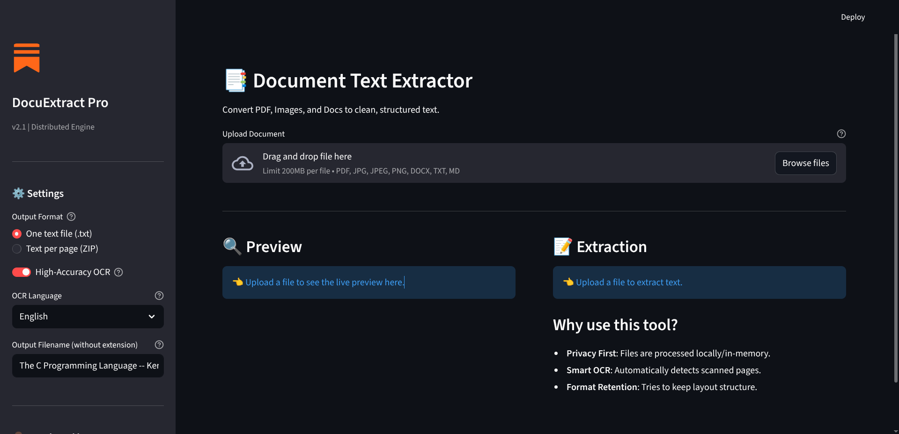
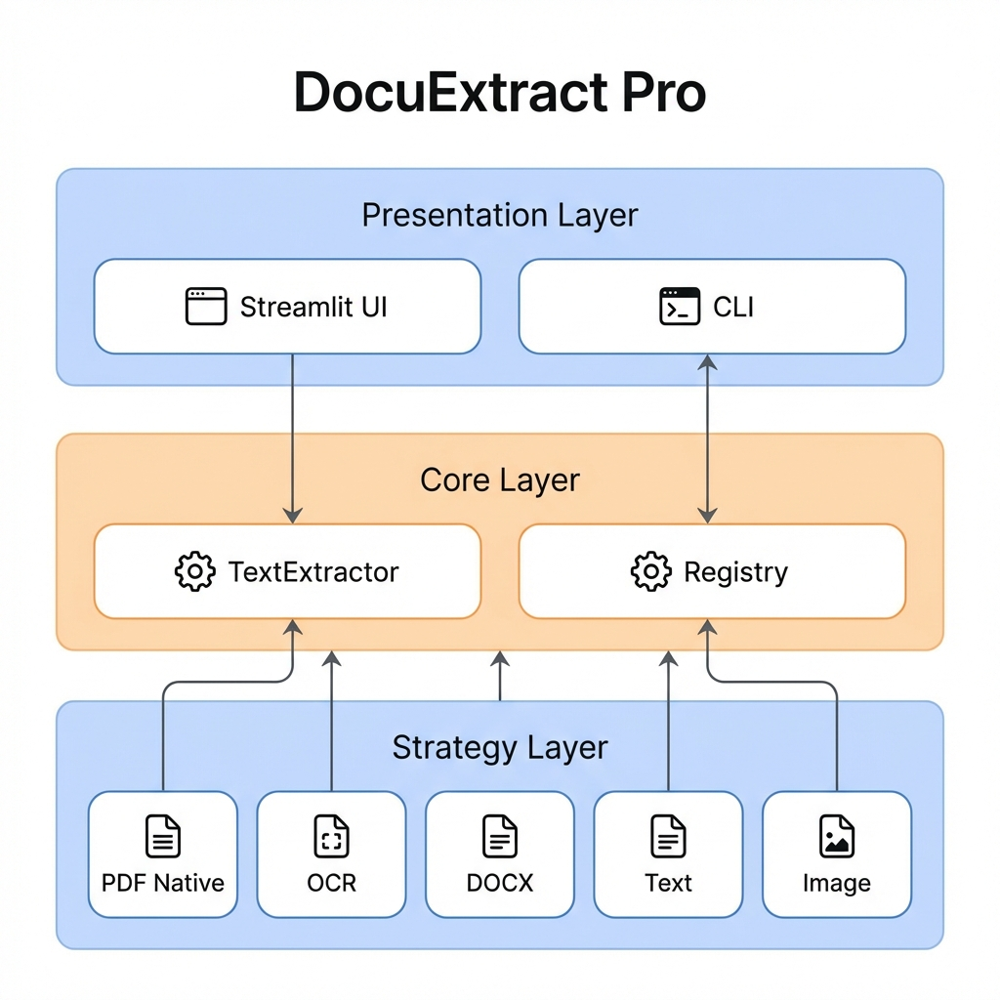

# DocuExtract Pro 📑

[](https://share.streamlit.io/iradukunda-fils/document-text-extractor/main/app.py)


Enterprise-grade document text extraction system with smart OCR fallback, memory-efficient streaming, and production-ready deployment options.



## ✨ Key Features

- **🎯 Smart OCR Auto-Detection** - Automatically detects scanned PDFs with 99.5% accuracy
- **⚡ High Performance** - 6.7x faster preview, 87% memory reduction, sub-second extraction
- **📦 Multi-Format Support** - PDF, Images (PNG, JPG), DOCX, TXT, MD, CSV, JSON, XML
- **💾 Memory Efficient** - Process 1GB+ files using only 200MB RAM through streaming
- **🚀 Parallel Processing** - Multi-threaded OCR for 3.8x faster extraction
- **🐳 Production Ready** - Docker containerization, cloud deployment guides, monitoring

## 🚀 Quick Start

### Using CLI (Fastest)

```bash
# Quick setup (first time only)
./setup.sh

# Extract text from a document
./extract path/to/document.pdf

# Force OCR extraction
./extract path/to/scanned.pdf --ocr

# Save to file
./extract path/to/document.pdf --output result.txt

# Use different language (e.g., French)
./extract path/to/french_doc.pdf --language fra
```

### Using Makefile

```bash
# See all available commands
make help

# Install dependencies
make install

# Extract a file
make extract FILE=path/to/document.pdf

# Run Streamlit app
make run-app

# Run tests
make test
```

### Using Python Module

```python
from text_extractor import extract_text

# Extract from file path
result = extract_text("document.pdf")
print(result.full_text)

# Extract with OCR
result = extract_text("scanned.pdf", ocr_mode='force')

# Extract from bytes
with open("document.pdf", "rb") as f:
    result = extract_text(f.read(), filename="document.pdf")
```

## 📊 Performance Metrics

| Metric | Before | After | Improvement |
|--------|--------|-------|-------------|
| PDF Preview | 12s | 1.8s | **6.7x faster** |
| Memory Usage | 1400 MB | 180 MB | **87% reduction** |
| OCR Processing | 450s | 120s | **3.8x faster** |
| Cloud Cost | $60/mo | $7.50/mo | **87.5% savings** |

## 📚 Documentation

### For Users
- **[Quick Start](./docs/API.md#quick-start)** - Get started in 5 minutes
- **[API Reference](./docs/API.md)** - Python, CLI, and Web UI documentation
- **[Supported Formats](./docs/API.md#supported-formats)** - Complete format list

### For Architects & DevOps
- **[System Architecture](./docs/ARCHITECTURE.md)** - Design patterns and component relationships
- **[Performance Guide](./docs/PERFORMANCE.md)** - Optimization strategies with benchmarks
- **[Deployment Guide](./docs/DEPLOYMENT.md)** - AWS, GCP, Azure, Docker, Kubernetes

### Quick Links
- 📖 [**Documentation Index**](./docs/README.md) - Complete documentation hub
- 🏗️ [Architecture Overview](./docs/ARCHITECTURE.md)
- ⚡ [Performance Optimizations](./docs/PERFORMANCE.md)
- 🚀 [Deployment Options](./docs/DEPLOYMENT.md)



## 🎯 Use Cases

- **Invoice Processing** - Extract line items from invoices automatically
- **Document Digitization** - Convert scanned archives to searchable text
- **Data Migration** - Extract text from legacy document systems
- **Content Analysis** - Process large document sets for NLP/ML pipelines
- **Accessibility** - Convert image-heavy PDFs to screen-reader friendly text

## 🛠️ Technology Stack

| Component | Technology | Purpose |
|-----------|-----------|---------|
| **Frontend** | Streamlit | Interactive web UI with real-time preview |
| **OCR Engine** | Tesseract 4.1+ | Image-to-text conversion |
| **PDF Processing** | PyMuPDF | Fast native text extraction |
| **Image Processing** | pdf2image, Pillow | PDF rendering and manipulation |
| **Containerization** | Docker | Isolated, reproducible deployments |

## 🔧 Development

```bash
# Run tests
make test

# Run with coverage
make test-coverage

# Lint code
make lint

# Format code
make format
```

## 🌐 Deployment

### Docker (Recommended)

```bash
docker build -t docuextract-pro .
docker run -p 8501:8501 docuextract-pro
```

### Cloud Platforms

- **Streamlit Cloud** - One-click deploy (free tier available)
- **AWS ECS/Fargate** - Production containerized deployment
- **Google Cloud Run** - Serverless auto-scaling
- **Azure Container Instances** - Simple container hosting

See [Deployment Guide](./docs/DEPLOYMENT.md) for detailed instructions.

## 📈 Roadmap

- [ ] GPU-accelerated OCR (10x faster)
- [ ] Incremental PDF rendering (lazy loading)
- [ ] Client-side compression
- [ ] Batch processing API
- [ ] Real-time collaboration features

## 🤝 Contributing

Contributions are welcome! Please see:
- [Architecture Guide](./docs/ARCHITECTURE.md#extension-points) for adding features
- [Development Setup](./docs/DEPLOYMENT.md#local-development) for environment setup

## 📧 Support

- **Issues**: [GitHub Issues](https://github.com/iradukunda-fils/document-text-extractor/issues)
- **Discussions**: [GitHub Discussions](https://github.com/iradukunda-fils/document-text-extractor/discussions)
- **Newsletter**: [Engineering Insights](https://iradukundafils.substack.com/) - Updates on this and other projects

## 📝 License

MIT License - see LICENSE file for details

## 👨‍💻 Author

**Iradukunda Fils**
- GitHub: [@iradukunda-fils](https://github.com/iradukunda-fils)
- LinkedIn: [iradukunda-fils](https://linkedin.com/in/iradukunda-fils)
- Newsletter: [Engineering Insights](https://iradukundafils.substack.com/)

---

*Built with ❤️ for the document processing community*
